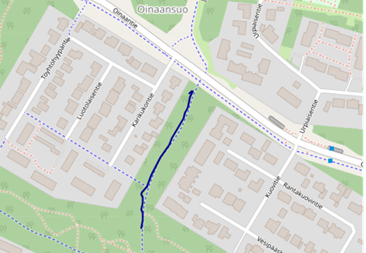
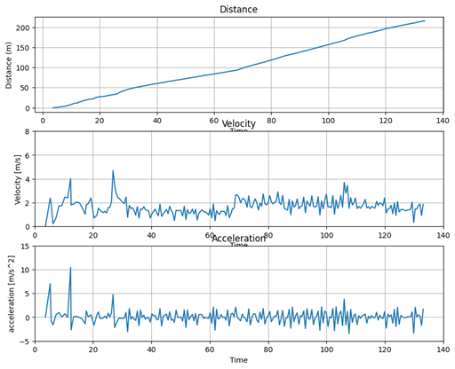
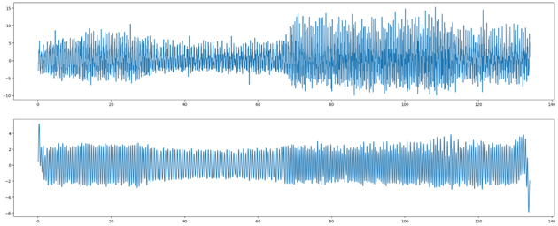

# Physics Final Project: Sports App Calculate and measure 

## Introduction
This Jupyter Notebook code analyze acceleration and GPS coordinate data, it  GPS collected data during walking. 
Use Python code to calculates various metrics and visualizes them using diagrams and numerical outputs.

## Calculations and Visualizations

### Map of Movement (Folium)
The Jupyter note book use Folium to analyze GPS and acceleration and draw a map This map show tester walking path.

### Distance, Velocity, and Acceleration graph
#### Distance graph 
A line graph is created to depict the cumulative distance covered over the walk, computed from GPS data points and starting from an initial value of zero.
#### Velocity graph
The graph displays the changes in velocity throughout the walk, derived from successive GPS coordinates to illustrate the variations in speed over time.
#### Acceleration Graph
The study of acceleration is conducted through the following visual representations and calculations:
1. Derived acceleration: A singular component acceleration value is computed from the velocity obtained from GPS data.
2. Measured acceleration: Directly recorded acceleration during the walk is depicted in three orthogonal components—lateral (x), longitudinal (y), and vertical (z).
#### summary 
According to the graph, the distance is approximately 215 meters, and the average velocity is around 1.6 meter/second.

### Number of Steps
The number of steps presents how many steps tester walked.
According to the calculation, the steps is 255.5 steps.

The graph of steps

## Answer below questions
### Does the acceleration calculated from the speed match the observed acceleration? 
A: The data does not tell enough information to check if matches or not.

### What differences do you notice? 
A: Due to acceleration measurements are sensitive to noises, during the measurement period, it may measure noises from the environment
The difference may include magnitude discrepancies in noise level. These are not reflected in the acceleration calculated from velocity. These differences could include many things.

### What could be their cause?
A: Sensor noise, data processing, or user force acting on the sensor (for example drop the measurement), and resolution limit (sensor determines the smallest change in acceleration it can detect). They are all appear as spikes or noise in the acceleration data.

### Logical Number of Steps
A: The total distance is around 215 meters, and the steps are 255 steps, according to the average adult step distance is 0.8-1.2 meters per step (depending on the walker's height, and behavior), these steps are logical.

## Conclusion
This Jupyter Notebook provides a comprehensive analysis of the acceleration and GPS coordinate data collected during the walk. It offers insights into the movement patterns and performance metrics, along with discussions on the observed differences and logical implications of the results.
